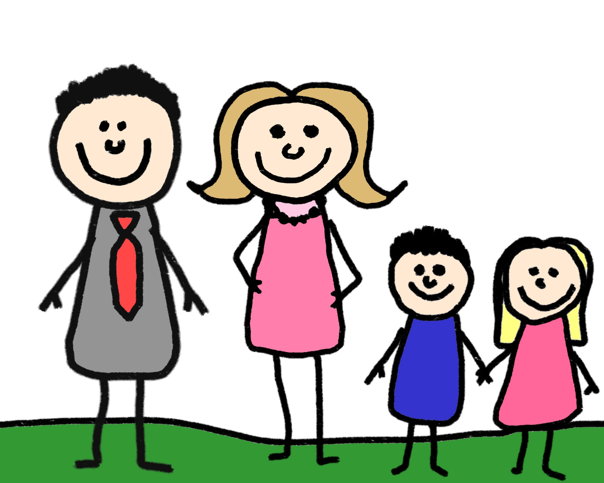

<h1>Familie</h1>

<h2> Here you will be able to learn some vocbulary and sentences in relation to family.</h2>

 Scroll down to see an watch the video with useful vocabulary and sentences. There will be useful tips and notes along the page. You will also find different activities. Give it a go- you can become a german wizard.

<iframe width="560" height="315" src="https://www.youtube.com/embed/i_DDxF_AfMY?rel=0" frameborder="0" allow="autoplay; encrypted-media" allowfullscreen></iframe>

<h2> Vocabulary</h2>

 Below, find the table with useful vocabulary centered around the topic, family. It will be in german followed by the english translation. 

    
<html>
<head>

</head>
<body>

<table>
  <tr>
    <th>German</th>
    <th>English</th>
  </tr>
  <tr>
    <td>Familie</td>
    <td>Family</td>
  </tr>
  <tr>
    <td>Familenmitglieder</td>
    <td>Family members</td>
  </tr>
  <tr>
    <td>Verwandten</td>
    <td>Relatives</td>
  </tr>
  <tr>
    <td>(Gross-)Eltern</td>
    <td>(Grand-)Parents</td>
  </tr>
  <tr>
    <td>Geschwister</td>
    <td>Siblings</td>
  </tr>
  <tr>
    <td>Vater/Mutter</td>
    <td>Father/Mother</td>
  </tr>
  <tr>
    <td>Bruder/Schwester</td>
    <td>Brother/Sister</td>
  </tr>
  <tr>
    <td>Opa/Oma</td>
    <td>Grandpa/Grandma</td>
  </tr>
    <tr>
    <td>Onkel/Tante</td>
    <td>Uncle/Aunty</td>
  </tr>
  
</table>

</body>
</html>

<h2> Vocabulary</h2>

 Below, find the table with useful vocabulary centered around the topic, countries. It will be in german followed by the english translation. 

<iframe src="https://h5p.org/h5p/embed/168374" width="1090" height="830" frameborder="0" allowfullscreen="allowfullscreen"></iframe>

<h2> Vocabulary</h2>

 Below, find the table with useful vocabulary centered around the topic, countries. It will be in german followed by the english translation. 

    
<iframe src="https://h5p.org/h5p/embed/168196" width="1090" height="693" frameborder="0" allowfullscreen="allowfullscreen"></iframe>

<h3>Other useful links.</h3>

If you want to learn more about countries in german then have a look at the following links.
  
  <a href="https://www.youtube.com/watch?v=npzGh2GorGQ&t=38s">Video on family.</a>

  
<a href="https://www.thoughtco.com/beginner-german-for-family-members-4064661">Website on family.</a>

<h2> Hope you had fun! You are one step closer to becoming a german wizard and becoming awesome at german.</h2>

<a style="float:left;" href="index.html">Back to Home page</a>
                                      
<a style="float:right;" href="hobbies.html"> Continue to Hobbies</a>
 

<ul class="breadcrumb">
  <li><a href="index.html">Home</a></li>
  <li>Family</li>
  <li><a href="hobbies.html">Hobbies</a></li>
  <li><a href="countries.html">Countries</a></li>
  <li><a href="weather.html">Weather</a></li>
  <li><a href="clothes.html">Clothes</a></li>
</ul>
